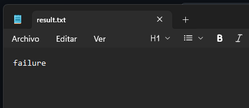
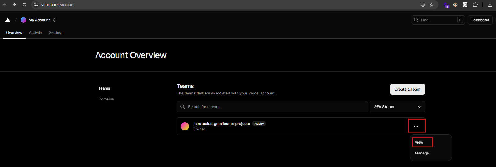

<!---BADGE_TESTED-WITH-CYPRESS-->

<!--BADGE_CYPRESS-WORKFLOW-OUTCOME-->

# Practica

### Linter Job

- Workflow

- Resultat en el que vetgem que el linter retorna errors

- Una volta corregits, vetgem que el linter no retorna errors

### Cypress 

- Workflow

- Artifact

- Artifact arxiu

### Add badge

- Worflow

- Action creada

### Deploy job

- Workflow

- El worflow necesita configurar els secrets VERCEL_TOKEN, VERCEL_ORG_ID i VERCEL_PROJECT_ID. Més abaix s'explica com agregar-ho a github. URL: <https://nodejs-blog-practica-12341234123.vercel.app/>

- Per a obtindre els secrets nomenats, ens crearem un conter en <https://vercel.com/>, després, crearem un projecte i obtindrem el PROJECT_ID desde el seguent menu

- El ORG_ID s'obté de la seguent forma

- El TOKEN s'obté de la seguent forma

# Enviament de notificació

- Workflow

- Action creada

# Secrets

